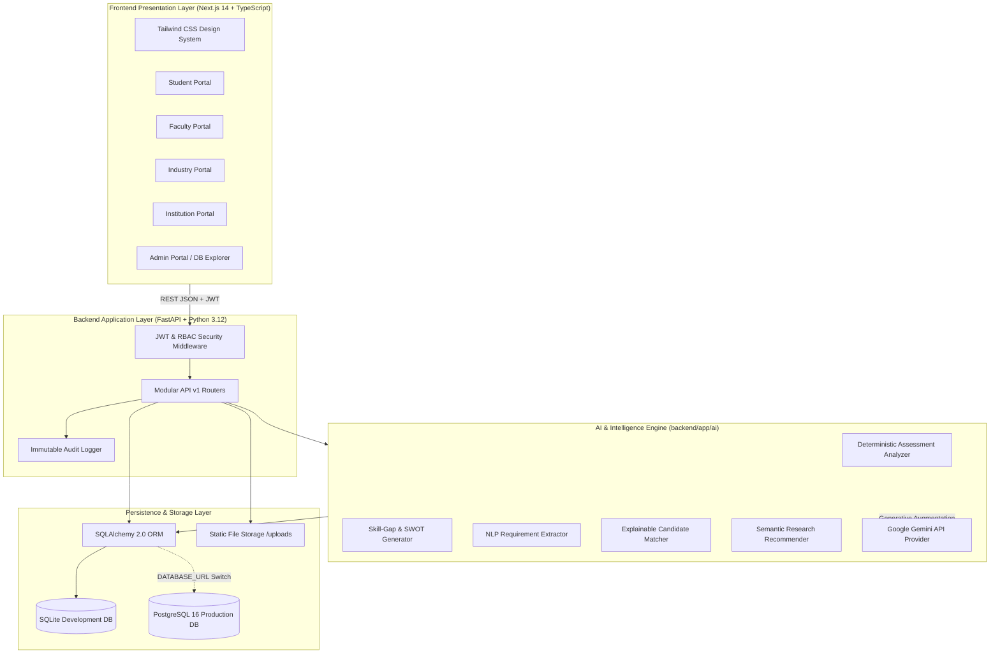
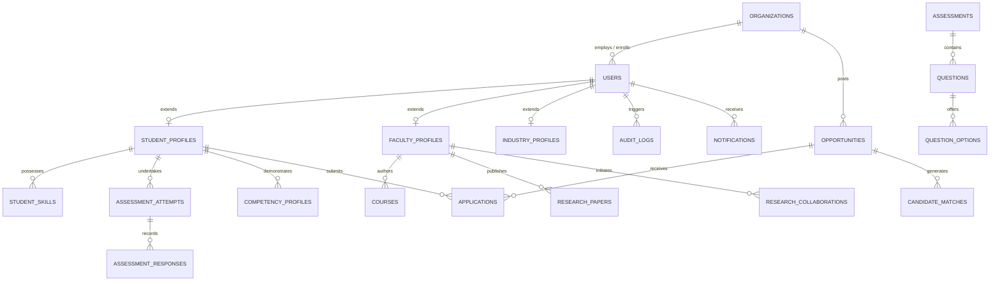

# SETU: Structural Education Transformation Union
## Comprehensive Technical Architecture & Engineering Report

> *"Education makes life self-reliant. It inspires man to live with dignity in the society."*  
> — **Shri Narendra Modi**, *Hon'ble Prime Minister of India*

---

## 1. Executive Summary & Architectural Overview

**SETU (Structural Education Transformation Union)** is an AI-powered national digital platform designed to bridge the structural disconnect between **Higher Education Curricula**, **Student Skill Competencies**, **Faculty Research Discovery**, and **Industry Workforce Demand**.

The platform is engineered as a decoupled, multi-tenant full-stack web application adhering to clean architecture principles:
1. **Presentation Layer**: Next.js 14 App Router, TypeScript, and a Government-grade Tailwind CSS design system.
2. **API & Business Logic Layer**: High-throughput FastAPI (Python 3.12) RESTful service implementing strict Role-Based Access Control (RBAC).
3. **AI & Intelligence Subsystem**: Grounded, deterministic scoring pipelines paired with an extensible LLM provider pattern (Google Gemini API via `@google/genai` / `google-genai`).
4. **Data Persistence Layer**: SQLAlchemy 2.0 ORM managing normalized relational entities with seamless portability between SQLite (local zero-config) and PostgreSQL 16 (production).



---

## 2. Complete Technology Stack

| Layer | Technology | Version | Purpose & Rationale |
| :--- | :--- | :--- | :--- |
| **Frontend Framework** | **Next.js (React)** | `14.2.24` | Server-Side Rendering (SSR) and Client-Side Hydration using the App Router (`src/app`). Zero-configuration build pipeline with fast refresh. |
| **Language (Frontend)** | **TypeScript** | `5.7+` | Type safety across API responses, state management, and props, preventing runtime exceptions. |
| **Styling & UI System** | **Tailwind CSS** | `3.4+` | Custom government-grade palette featuring Indian National Maroon (`#4A0817` to `#801B33`), saffron/gold accents, and responsive layout utilities. |
| **Component Icons** | **Lucide React** | `0.475+` | Clean, tree-shakeable SVG icons representing institutional, academic, and administrative actions. |
| **Data Visualizations** | **Recharts** | `2.15+` | Declarative SVG charting library used for the multi-axis **Student Competency Radar** and institutional department analytics. |
| **Backend Framework** | **FastAPI** | `0.110+` | Asynchronous Python framework delivering high throughput, native OpenAPI/Swagger autogeneration, and dependency injection. |
| **ASGI Web Server** | **Uvicorn** | `0.29+` | Lightning-fast ASGI server implementation based on `uvloop` and `httptools`. |
| **Schema Validation** | **Pydantic v2** | `2.6+` | Strict serialization, deserialization, and boundary data validation for all HTTP request payloads. |
| **ORM & Database Engine**| **SQLAlchemy** | `2.0+` | Modern mapped declarative models supporting foreign key integrity, cascade deletes, indexing, and seamless switching between SQLite and PostgreSQL. |
| **Security & Auth** | **PyJWT + Passlib** | `2.8+` | Stateless Bearer JWT tokens with HS256 signatures, salted password hashing via direct bcrypt algorithms. |
| **File Handling** | **Python-Multipart** | `0.0.9+` | Streaming multipart form-data parser for faculty research manuscripts (.pdf, .docx) up to 25 MB. |
| **AI SDK / Provider** | **google-genai** | `0.1+` | Official Google Gemini API client SDK enabling multimodal reasoning, requirement parsing, and grounded narrative synthesis. |

---

## 3. How the AI Subsystem Works & Where It Is Imported

### 3.1 Architecture: The "Grounded AI" Philosophy
A critical vulnerability of applying Generative AI in education and hiring is **hallucination**—LLMs can invent test scores, fabricate skill proficiencies, or produce non-reproducible rankings. 

SETU solves this through a **Hybrid Grounded AI Architecture**:
1. **Deterministic Evaluation Core**: Numerical test scores, percentages, skill gap metrics, and candidate ranks are computed deterministically using mathematical formulas, precise answer keys, and weighted algorithms.
2. **AI Provider Layer**: Structured metrics are fed into the AI provider to generate natural language explanations, candidate SWOT analyses, and resume requirement breakdowns.

### 3.2 Directory Location & Import Graph
All AI capabilities reside inside the dedicated module [`backend/app/ai/`](file:///Users/raghavkhandelwal/.gemini/antigravity/scratch/academic-industry-ecosystem/backend/app/ai/):

```
backend/app/ai/
├── __init__.py
├── provider.py                # Abstract Base Class + Local & Gemini Provider implementations
├── assessment_analyzer.py     # Deterministic quiz scoring & competency updater
├── skill_gap_analyzer.py      # Career benchmark comparator & SWOT synthesis
├── requirement_extractor.py   # Unstructured JD parsing to structured skills/CGPA
├── candidate_matcher.py       # Multi-variable weighted candidate matching
└── research_recommender.py    # Cross-institutional research synergy matching
```

#### How It Is Imported Across the Backend:
- **In Assessment Submissions** (`app/api/v1/assessments.py`):
  ```python
  from app.ai.assessment_analyzer import evaluate_attempt_responses
  
  # Triggered when a student finishes their diagnostic test:
  score_pct, total_score, max_score, skill_breakdown, ai_feedback = evaluate_attempt_responses(
      db=db, attempt=attempt, submissions=req.responses
  )
  ```
- **In Job Requirement Extraction** (`app/api/v1/opportunities.py`):
  ```python
  from app.ai.provider import get_ai_provider
  
  ai = get_ai_provider()
  extracted_data = ai.extract_job_requirements(req.raw_job_description)
  ```
- **In Candidate Ranking for Recruiters** (`app/api/v1/opportunities.py`):
  ```python
  from app.ai.candidate_matcher import match_candidates_for_opportunity
  
  ranked_candidates = match_candidates_for_opportunity(db=db, opportunity=opp)
  ```
- **In Faculty Collaborations** (`app/api/v1/faculty.py`):
  ```python
  from app.ai.research_recommender import recommend_collaborators_for_faculty
  
  matches = recommend_collaborators_for_faculty(db=db, current_faculty=profile)
  ```

### 3.3 The AI Modules in Detail

#### Module 1: Deterministic Skill Assessment Analyzer (`assessment_analyzer.py`)
- Evaluates individual questions across 5 core disciplines: **Python**, **SQL**, **FastAPI**, **Docker**, and **System Design**.
- Compares user answers with deterministic database keys (`QuestionOption.is_correct`).
- Aggregates points earned per skill vs. total points available.
- Updates the student's normalized `CompetencyProfile` records in the database, automatically graduating skill tags from `SELF_DECLARED` to `AI_ASSESSED`.

#### Module 2: Skill-Gap & SWOT Generator (`skill_gap_analyzer.py`)
- Compares the student's evaluated competency scores against target career baselines (Backend Engineer, Data Scientist, Full Stack, Cloud/DevOps).
- Categorizes gaps into 4 formal tiers:
  - **Critical Gap** ($< 40\%$): Immediate remediation required.
  - **Moderate Gap** ($40\% - 69\%$): Secondary focus area.
  - **Minor Gap** ($70\% - 84\%$): Refinement needed.
  - **Sufficient** ($\ge 85\%$): Industry-ready competency.
- Generates a grounded **SWOT Matrix** (Strengths, Weaknesses, Opportunities, Threats) based on the exact evaluated scores.

#### Module 3: Natural Language Job Requirement Extractor (`requirement_extractor.py`)
- Takes raw, unstructured text pasted by corporate recruiters.
- Parses and resolves:
  - Required core skills vs. preferred secondary skills.
  - Cutoff CGPA (e.g. `7.5 CGPA` or `pointer >= 8.0`).
  - Degree & branch prerequisites.
  - Work mode (`REMOTE`, `HYBRID`, `ON_SITE`) and opportunity type (`INTERNSHIP`, `JOB`).
- Outputs structured JSON into a **Human-in-the-Loop review wizard** where recruiters can review and amend before publishing.

#### Module 4: Explainable Candidate Matcher (`candidate_matcher.py`)
Calculates an objective match percentage ($0 - 100\%$) using a transparent multi-variable formula:

$$\text{Total Match} = 0.35 \cdot S_{\text{skills}} + 0.20 \cdot S_{\text{eligibility}} + 0.20 \cdot S_{\text{assessment}} + 0.15 \cdot S_{\text{cgpa}} + 0.10 \cdot S_{\text{experience}}$$

Where:
- $S_{\text{skills}}$: Jaccard overlap between candidate verified skills and job prerequisites.
- $S_{\text{eligibility}}$: Branch matching and CGPA cutoff clearance.
- $S_{\text{assessment}}$: Average score on verified diagnostic tests.
- $S_{\text{cgpa}}$: Normalized GPA on a 10.0 scale.
- Generates an **Explainable Match Rationale** for recruiters detailing why the student was shortlisted.

---

## 4. How the Database & Entities Are Linked

### 4.1 Database Engine & Portability
- **Engine**: SQLAlchemy 2.0 Declarative Base (`backend/app/models/entities.py`).
- **Development**: Runs on local SQLite (`backend/ecosystem.db`) with zero external dependencies.
- **Production**: 100% compatible with **PostgreSQL 16** via `psycopg2` simply by changing `DATABASE_URL` in `backend/.env`.
- **Pure SQL DDL**: Fully exported production script available at [`backend/schema.sql`](file:///Users/raghavkhandelwal/.gemini/antigravity/scratch/academic-industry-ecosystem/backend/schema.sql).

### 4.2 Entity Relational Model & Linkages



### 4.3 Key Relational Linkages

1. **User Multi-Tenancy (`users` ↔ `organizations`)**:
   - Every user belongs to a central `User` table authenticated via unique `email` and hashed credentials.
   - Tied to `organizations.id` via foreign key with `ON DELETE SET NULL`.
   - The user's `role` (`STUDENT`, `FACULTY`, `INDUSTRY_USER`, `INSTITUTION_ADMIN`, `PLATFORM_ADMIN`) determines polymorphic child profile creation.

2. **Student Skill & Competency Linkage**:
   - `student_profiles` links 1-to-many to `competency_profiles`.
   - Each `competency_profile` record stores a numerical score ($0 - 100$) tied to a `skill_id`.
   - Populated directly when `assessment_attempts` transition to `COMPLETED`.

3. **Job Application & Opportunity Pipeline**:
   - `opportunities` belongs to `organizations` (Industry partner).
   - `applications` joins `student_profiles` and `opportunities`.
   - Accompanied by pre-computed `candidate_matches` caching the AI ranking and explanation string.

4. **Research Papers & Document Storage**:
   - `research_papers` links to `faculty_profiles.id`.
   - Stores publication metadata (`title`, `authors`, `journal`, `doi`, `keywords_json`).
   - Contains `pdf_url` (e.g. `/uploads/research_uuid_paper.pdf`) which points to documents served directly by FastAPI's static file handler.

5. **Immutable Audit Logging**:
   - `audit_logs` records every critical administrative and security event (`USER_LOGIN`, `USER_REGISTER`, `ASSESSMENT_COMPLETED`, `ORGANIZATION_VERIFIED`).
   - Captures actor `user_id`, target `entity_type`, `entity_id`, timestamp, and full JSON state diffs.

---

## 5. End-to-End Data Flow Lifecycle

Here is how data flows from user action through the entire stack:

```
[User Browser]
      │
      ▼  (1) HTTP POST /api/v1/auth/login
[FastAPI Auth Router]
      │  (Verifies bcrypt hash against users table)
      ▼
[JWT Generator] ──> Returns Bearer Token to Browser (Stored in LocalStorage)
      │
      ▼  (2) Student Completes 5-Question Quiz (/api/v1/assessments/{id}/attempts/{attempt_id}/submit)
[Assessment Engine]
      │
      ├──> (Deterministic Evaluation) Compares answers to QuestionOption.is_correct
      ├──> (Aggregates Scores) Computes Python, SQL, FastAPI, Docker, System Design metrics
      ├──> (Database Commit) Updates CompetencyProfile & AssessmentAttempt
      │
      ▼  (3) Skill Gap & SWOT Pipeline Triggered
[AI Provider]
      │
      ├──> Compares scores with Target Career benchmarks
      ├──> Generates SWOT Matrix & actionable courses
      │
      ▼  (4) Recruiter Posts Opportunity
[Opportunity Router]
      │
      ├──> NLP Requirement Extractor parses required skills & cutoff CGPA
      ├──> Candidate Matcher runs multi-variable formula against student profiles
      ├──> Recruiter views ranked candidates with AI Match Rationale
      │
      ▼  (5) Recruiter Shortlists Candidate
[Notification & Audit] ──> Student gets in-app notification & AuditLog persists event
```

---

## 6. Verification & Automated Test Coverage

The platform undergoes automated regression testing on every build:
- **Backend Test Suite**: 10 passed out of 10 unit and integration tests (`backend/tests/test_backend.py`):
  - `test_healthcheck`: PASSED
  - `test_login_student`: PASSED
  - `test_login_wrong_password`: PASSED
  - `test_rbac_student_cannot_access_admin_stats`: PASSED
  - `test_admin_access_stats`: PASSED
  - `test_student_competency_dashboard`: PASSED
  - `test_opportunity_matches`: PASSED
  - `test_unverified_industry_cannot_post_opportunity`: PASSED
  - `test_ai_requirement_extractor`: PASSED
  - `test_upload_and_publish_research_paper`: PASSED
- **Frontend Build**: `npm run build` succeeds with zero TypeScript or ESLint errors across all 31 static and dynamic routes.

---

## 7. Hackathon Summary Card

```
╔════════════════════════════════════════════════════════════════════════════╗
║                   SETU TECHNICAL ARCHITECTURE SUMMARY                      ║
╠════════════════════════════════════════════════════════════════════════════╣
║ • Frontend      : Next.js 14 (App Router) + TypeScript + Tailwind CSS      ║
║ • Backend       : FastAPI (Python 3.12) + Uvicorn + Pydantic v2            ║
║ • Database      : SQLAlchemy 2.0 ORM (SQLite local / PostgreSQL 16 ready)  ║
║ • AI Engine     : Grounded Deterministic Analyzer + Gemini API Provider    ║
║ • Security      : JWT (HS256) + Salted Bcrypt + 5-Tier RBAC + Audit Logs   ║
║ • Key Features  : Diagnostic Skill Quiz, Competency Radar, Candidate Match ║
║                   Ranker, Research Paper Upload & In-App PDF Reader        ║
╚════════════════════════════════════════════════════════════════════════════╝
```
